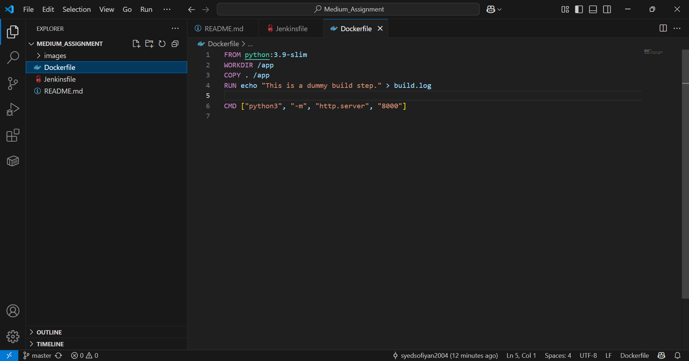
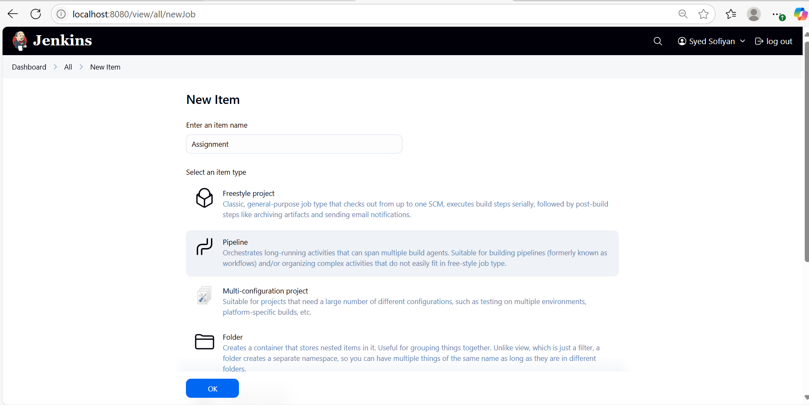
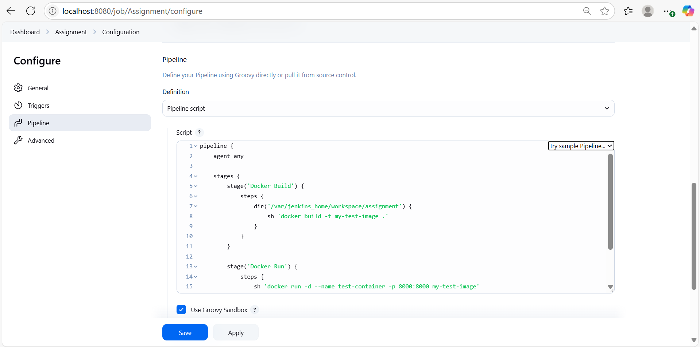
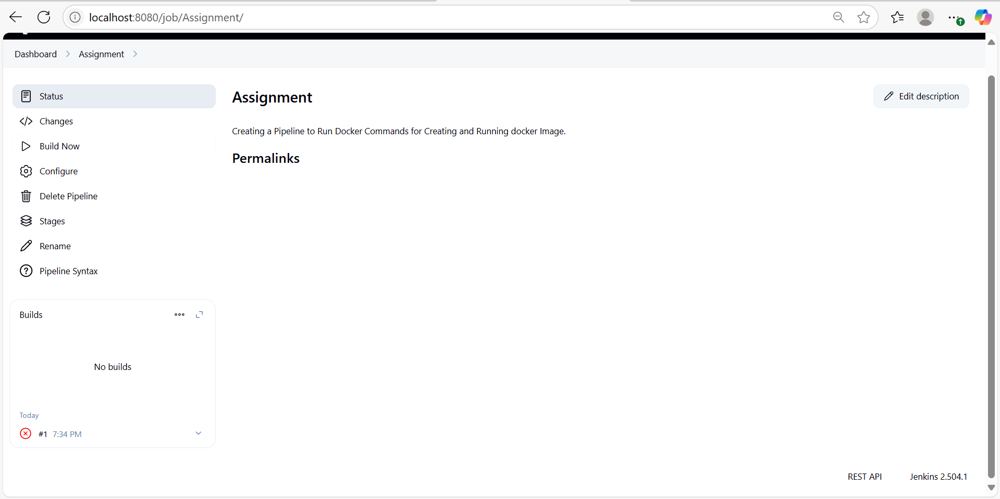
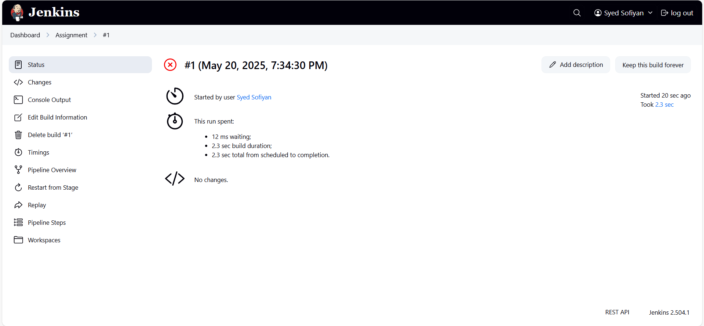
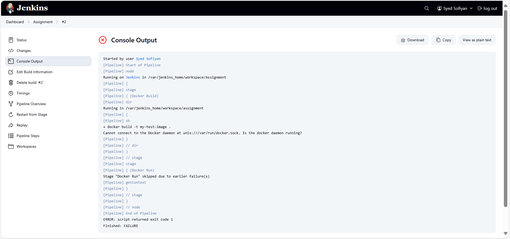

### **Medium Assignment**
Here our Goal is to find whether the Docker File can be run on Docker Container on which Jenkins Application is already running,
So first we have to create a Docker file which will have the docker image and all the other necessary aspects which should be contained in a docker file



now we have to create a Pipeline which will run this docker file after creating its image as we can see in the image we are creating a new Image named Assignment


 As we can see in the image we are writing a groovy code as stage 1 and stage 2 where we have docker commands for image creation and image run as follows:
 ```sh
docker build -t my-test-image .
docker run -d --name test-container -p 8000:8000 my-test-image
```


now we have to save this pipeline and then proceed to Build this as we can see in the image that there is a job in the build history with a cross sign



If we press that job we can see its what has happened in this



If we want to see the actual error we can view them in the Console Output as shown in the image




Here the main reason for the error is that the Daemon not found which indicates that there is a docker inside a docker container but its not mapping to any specific application as the jenkins is confused that which container is a host and which is not we need to setup that to resolve this error.


### **End Of Assignment**
